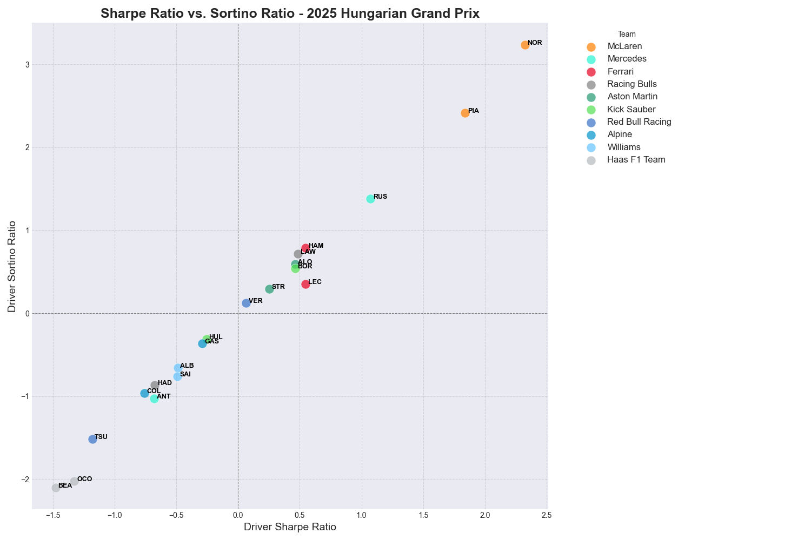
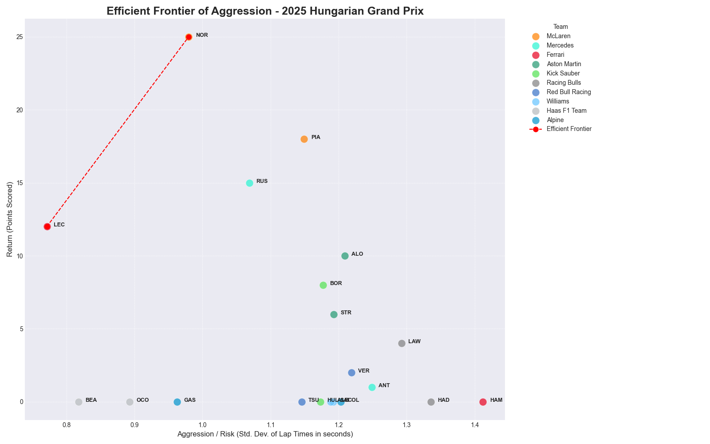

# F1 Driver Performance: Sortino Ratio & The Aggression Frontier

This analysis extends the concepts from the Sharpe Ratio project to provide a more nuanced view of driver performance, focusing on the nature of their lap time volatility. It introduces two key concepts: the **Sortino Ratio** and the **Efficient Frontier of Aggression**.

-   **Sortino Ratio**: Differentiates between "good" volatility (exceptionally fast laps) and "bad" volatility (costly mistakes). It helps identify drivers who are "aggressively fast" without being prone to errors.
-   **Aggression Frontier**: A separate analysis that visualizes which drivers are most effective at converting their driving style—whether consistent or aggressive—into championship points.

## Methodology

### 1. Sortino Ratio: Measuring "Controlled Aggression"

This analysis uses the same dynamic, stint-specific benchmarking as the Sharpe Ratio project to calculate the `LapTimeDelta` (the difference between a driver's actual lap time and the expected pace).

The key difference lies in how "risk" is measured:

-   **Sharpe Ratio Risk**: Uses the standard deviation of *all* lap time deltas. It penalizes a driver equally for a lap that is 1 second faster than expected and a lap that is 1 second slower.
-   **Sortino Ratio Risk**: Uses **Downside Deviation**. This is the standard deviation of *only the laps that were slower* than the driver's own average for that stint.

The formula is:

`Sortino Ratio = -Mean(LapTimeDelta) / DownsideDeviation`

A driver with a Sortino Ratio significantly higher than their Sharpe Ratio is effectively managing their risk. They may have high overall volatility (pushing the limits and setting exceptionally fast laps), but they avoid the costly mistakes and slow laps that lose time. This is the hallmark of "controlled aggression."

### 2. The Efficient Frontier of Aggression

This is a parallel analysis that frames the risk/return trade-off in more direct race terms:

-   **Risk**: The standard deviation of a driver's clean lap times throughout the race. This is a direct proxy for their level of aggression or consistency.
-   **Return**: The total points scored by the driver in the race.

By plotting every driver on a chart of Risk vs. Return, we can identify an "Efficient Frontier." A driver is on this frontier if no other driver achieved a higher return (more points) for the same or a lower level of risk (lap time volatility). Drivers on the frontier are the most effective at translating their driving style into a tangible race result.

## File Descriptions

-   `driver_sortino_ratio.py`: The main data processing script. It calculates both the Sharpe and Sortino ratios for every driver in a race and saves the output.
-   `visualize_ratios.py`: Generates a scatter plot comparing each driver's Sharpe Ratio to their Sortino Ratio, which is key for identifying controlled aggression.
-   `visualize_aggression_frontier.py`: Performs the efficient frontier analysis, plotting lap time volatility against points scored.
-   `generate_article_visuals.py`: A standalone script that produces a series of plots designed to tell a narrative about the concepts in this analysis, likely for an article or presentation.

## How to Run the Analysis

1.  **Calculate Ratios**:
    -   Open `driver_sortino_ratio.py`.
    -   Modify the `year` and `race_name` variables in the `main()` function.
    -   Run the script. This will generate the primary CSV data file.
        ```bash
        python QuantF1/2_Sortino_Ratio/driver_sortino_ratio.py
        ```

2.  **Visualize Sharpe vs. Sortino**:
    -   Ensure the CSV from the previous step has been generated.
    -   Run the `visualize_ratios.py` script.
        ```bash
        python QuantF1/2_Sortino_Ratio/visualize_ratios.py
        ```

3.  **Visualize the Aggression Frontier**:
    -   Open `visualize_aggression_frontier.py`.
    -   Modify the `YEAR` and `RACE_NAME` variables at the top of the script.
    -   Run the script.
        ```bash
        python QuantF1/2_Sortino_Ratio/visualize_aggression_frontier.py
        ```

## Interpreting the Output

### Sharpe vs. Sortino Scatter Plot

This plot is the primary output for understanding controlled aggression.

-   Drivers lying on the `y = x` line have symmetrical volatility; their fast laps are as common as their slow laps.
-   Drivers **above** the `y = x` line have a higher Sortino Ratio than Sharpe Ratio. This is the key insight: these drivers exhibit "good" volatility. They have exceptionally fast laps that increase their overall standard deviation (lowering their Sharpe Ratio), but they manage to avoid costly slow laps (keeping their Downside Deviation low, thus boosting their Sortino Ratio).



### Aggression Frontier Plot

This plot shows who is getting the most "bang for their buck."

-   Drivers **on the frontier** are the most efficient. They are maximizing their points return for their chosen level of risk/aggression.
-   Drivers **below the frontier** are taking on risk without a proportional reward. For their level of aggression, another driver on the frontier achieved a better result.


