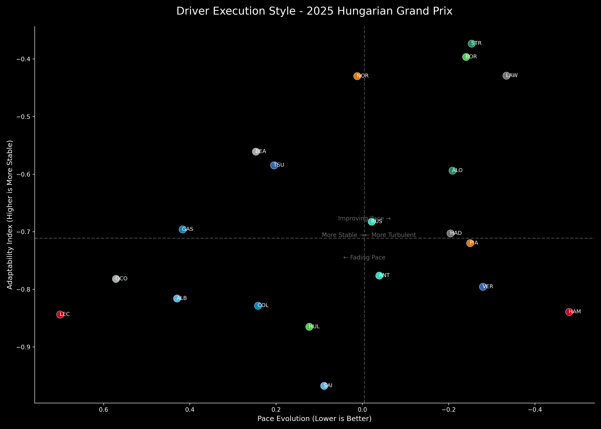

# F1 Driver Execution Style: The Adaptability Index

This project introduces a temporal dimension to driver performance analysis. Instead of producing a single score for an entire race, it aims to classify a driver's **execution style** by measuring how their pace and consistency evolve from the start to the finish.

The analysis answers questions like:
- Is the driver's performance smooth and stable or turbulent and erratic?
- As the race progresses, does the driver get faster and find a rhythm, or do they fade relative to the competition?

## Methodology

The analysis is built on two key metrics that are plotted against each other to classify drivers into one of four styles. It uses the same dynamic, stint-specific benchmark from the Sharpe and Sortino ratio analyses to calculate a `LapTimeDelta` (the difference between actual and expected pace) for every lap.

### 1. The Adaptability Index (Y-Axis: Stability)

This metric quantifies how stable or "turbulent" a driver's performance is.

-   **Formula**: `Adaptability Index = -StandardDeviation(LapTimeDelta)`
-   **Interpretation**: It is calculated as the negative standard deviation of the driver's pace deltas throughout the race. A lower standard deviation signifies a more consistent and stable driver. By negating the value, a **higher index (a number closer to zero) is better**, representing a "smoother" or more adaptable driver.

### 2. Pace Evolution (X-Axis: Pace Trend)

This metric quantifies whether a driver's pace improves or fades as the race unfolds.

-   **Method**:
    1.  The race is divided into segments (e.g., three parts: beginning, middle, and end).
    2.  The driver's average `LapTimeDelta` is calculated for each segment.
    3.  A linear regression trendline is fitted to these average deltas across the segments.
-   **Interpretation**: The **slope** of this trendline is the `PaceEvolution`. A **negative slope is ideal**, as it indicates the driver's pace is improving relative to the benchmark over time. A positive slope indicates their pace is fading.

## The Four Execution Styles

The primary output is a scatter plot that places each driver into one of four quadrants based on their stability and pace trend. **Note: The X-axis is inverted, so right is better.**



-   **Top-Right (Smooth Improver)**: High stability and an improving pace trend. This is the ideal quadrant, representing a driver who is both consistent and getting faster as the race progresses.
-   **Top-Left (Smooth Fader)**: High stability but a fading pace trend. This could represent a conservative driver, one who is over-managing their tires, or someone whose car setup is not optimal as fuel burns off.
-   **Bottom-Right (Turbulent Improver)**: Low stability (erratic) but an improving pace trend. This is the style of an aggressive, "on-the-edge" driver who may make small mistakes but ultimately finds more pace as the race develops.
-   **Bottom-Left (Turbulent Fader)**: Low stability and a fading pace trend. This is the most challenging quadrant, typically indicating a driver who is struggling with their car, the track conditions, or tire degradation.

## File Descriptions

-   `driver_adaptability_index.py`: The main and only script for this analysis. It calculates the Adaptability Index, Pace Evolution, and Consistency Evolution for all drivers, then saves the results to a CSV file and generates the summary plot.

## How to Run the Analysis

1.  Open `driver_adaptability_index.py`.
2.  Modify the `year` and `race_name` variables inside the `main()` function at the bottom of the script.
3.  Run the script from your terminal:
    ```bash
    python QuantF1/3_Adaptibility_Index/driver_adaptability_index.py
    ```

## Interpreting the Output

-   **CSV File (`results/...` folder)**: Contains the raw `AdaptabilityIndex` and `PaceEvolution` slope for each driver.
-   **Summary Plot (`plots/...` folder)**: The scatter plot described above, which is the main tool for interpreting a driver's execution style for that race. Use the "Four Execution Styles" guide to understand each driver's position on the chart.
