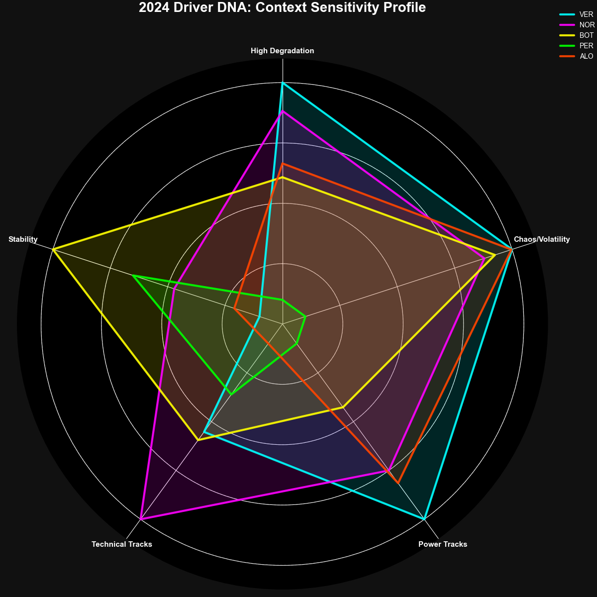

# F1 Driver DNA: Track Regime Sensitivity Profiling

This project represents the most advanced analysis in the `QuantF1` collection. It moves beyond single-race metrics to build a comprehensive, season-long "Driver DNA" profile. This profile quantifies a driver's strengths, weaknesses, and, most importantly, their **sensitivity** to different types of tracks and car characteristics.

The analysis answers deep, fundamental questions about driver performance:
- Is a driver a "Power" specialist or a "Downforce" specialist?
- How much does their performance depend on the car (Machine) versus their own ability to be consistent (Skill)?
- Which drivers have the most well-rounded profile across all track types?

## Methodology: A Four-Step Pipeline

The final Driver DNA profile is the result of a sequential, four-step data processing pipeline. Each script in this directory performs one step and generates the data needed for the next.

### Step 1: Classify Tracks into Regimes (`regime_classifier.py`)

First, we acknowledge that not all tracks are the same. This script uses a `K-Means` clustering algorithm to group tracks into data-driven "regimes" based on their physical characteristics (e.g., average speed, cornering difficulty, tire stress, power vs. downforce dependency). This automatically creates archetypes like "High-Speed," "Technical," and "Balanced."

### Step 2: Calculate Conditional Performance (`conditional_analysis.py`)

Next, this script calculates a suite of performance metrics (Pace, Consistency, Volatility, Error Rate) for every driver at every race of the season. It then merges this data with the track classifications from Step 1, allowing us to analyze performance "conditioned" on the track type.

### Step 3: Profile Drivers & Calculate Sensitivities (`driver_profiler.py`)

This is the core of the analysis where the "DNA" is synthesized.
-   **Profiling**: It aggregates each driver's performance across the different track regimes, revealing their average pace and consistency on "High-Speed" tracks versus "Technical" tracks, for example.
-   **Sensitivity Analysis**: It calculates a driver's "sensitivity score" to factors like Power, Downforce, and Tire Degradation. This is done by correlating their performance at each track with that track's rating for each factor. A high "Power Sensitivity" score means the driver consistently excels on power-dominant circuits.
-   **Skill vs. Machine Index**: It computes two final meta-scores: a `SkillIndex` (based on consistency and error rate) and a `MachineIndex` (based on raw pace and sensitivity to car-dependent factors).

### Step 4: Visualize the DNA (`visualize_regimes.py`)

The final script takes the complex data from the profiler and generates a suite of rich visualizations designed to make the Driver DNA easy to interpret.

## File Descriptions

-   `regime_classifier.py`: **Step 1:** Groups tracks into archetypes.
-   `conditional_analysis.py`: **Step 2:** Calculates driver performance for each race.
-   `driver_profiler.py`: **Step 3:** Aggregates performance by regime and calculates sensitivity profiles.
-   `visualize_regimes.py`: **Step 4:** Creates the final plots, including radar charts and heatmaps.

## How to Run the Analysis

The scripts **must be run in order**, as they form a sequential pipeline.

1.  **Run the Regime Classifier**:
    ```bash
    python QuantF1/4_Track_Regime_Sensitivity/regime_classifier.py
    ```
2.  **Run the Conditional Analysis**:
    ```bash
    python QuantF1/4_Track_Regime_Sensitivity/conditional_analysis.py
    ```
3.  **Run the Driver Profiler**:
    ```bash
    python QuantF1/4_Track_Regime_Sensitivity/driver_profiler.py
    ```
4.  **Run the Visualization Script**:
    ```bash
    python QuantF1/4_Track_Regime_Sensitivity/visualize_regimes.py
    ```

## Interpreting the Output

This pipeline generates numerous plots and CSV files. The most important visualizations are:

### 1. Driver DNA Radar Chart

This is the ultimate summary of a driver's profile. Each axis represents a different performance or sensitivity metric. A larger, more symmetrical shape indicates a more well-rounded and highly-rated driver. It allows for quick, visual comparison of driver strengths and weaknesses.



### 2. Skill vs. Machine Quadrant

This plot places drivers on a 2x2 grid based on their `SkillIndex` and `MachineIndex`.
-   **Top-Right (Elite)**: High skill and high machine dependence. These drivers extract the maximum from a top car.
-   **Top-Left (Overachiever)**: High skill but lower machine dependence. These drivers often outperform their car's perceived potential.
-   **Bottom-Right (Underachiever)**: Low skill but high machine dependence. These drivers may struggle with consistency or errors despite being in a competitive car.
-   **Bottom-Left (Developing)**: Low skill and low machine dependence. Often rookies or drivers in less competitive machinery.

### 3. Sensitivity Heatmaps and Bar Charts

These plots provide a direct ranking of drivers based on their sensitivity to factors like Power, Downforce, and Tire Degradation, making it easy to see who the specialists are in each category.
